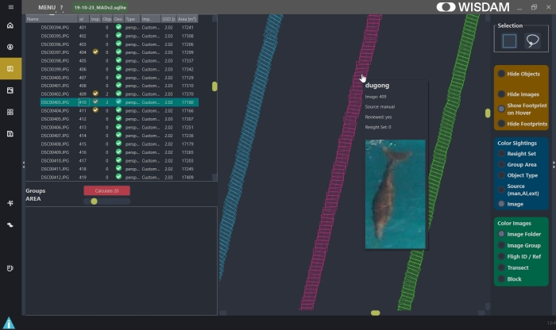
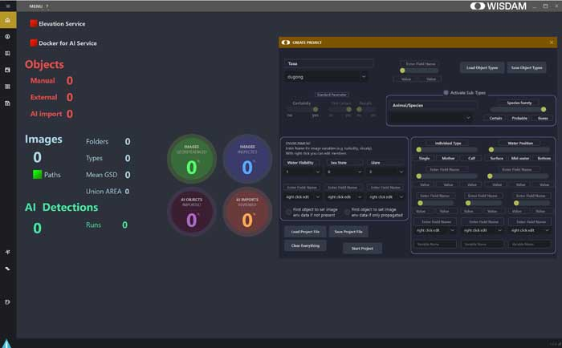
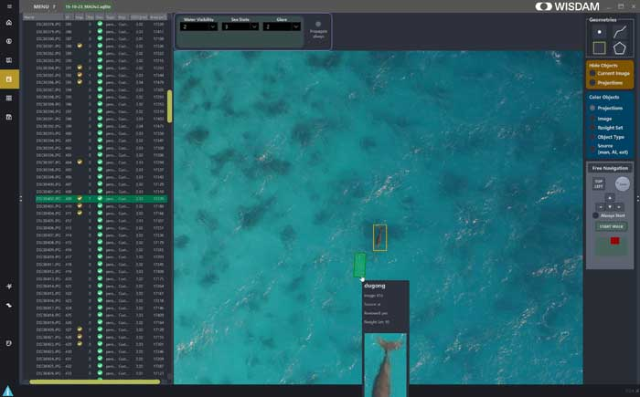
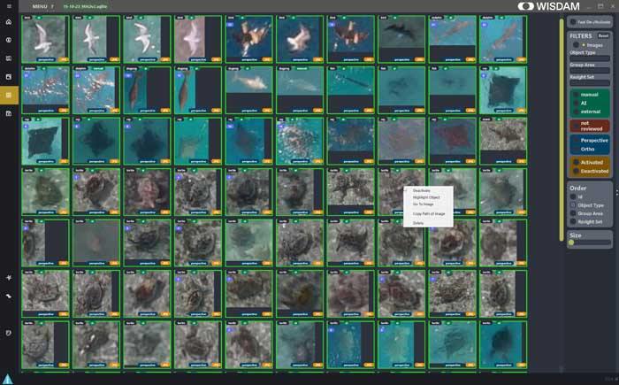

# 

**WISDAM** (**W**ildlife **I**magery **S**urvey – **D**etection and **M**apping) is a free-and-open-source (FOSS) software package used for the digitisation
of objects within images and to enrich objects with metadata.

Information about the WISDAM Project and its history can be found at www.wisdamapp.org 

The software uses the power of georeferenced images to map objects and to use the mapped location to perform actions, such as grouping or statistics.

WISDAM handle images from different sources (such as piloted aircraft and drones) and allow you to import them with their georeference information. Alternatively you can import orthophotos.

With this geo-reference information, image footprints and geometries of objects can be mapped to real world coordinates. For mapping in WISDAM either a raster model (e.g. DTM, DSM) or a simple plain (e.g. sea level) can be used.

WISDAM also allows you to run an AI background process on images, to extract objects that my not have been detected through manual review process. WISDAM helps to visualise and enrich these objects with meta-data.

WISDAM has been designed to optimise the workflow of environmental observation and is focused on the fast and easy handling of images and digitisation of objects. 

> [!IMPORTANT]  
> WISDAM is under development and did undergo a major refactoring. If you encounter any bugs (crashes, error, wrong calculations),
> please submit a bug issue as described under contribution. You can save the information from the logfile within WISDAM
> and error message was printed.

## Table of Contents
- [Features](#features)
- [Installing and using WISDAM](#installing-and-using-wisdam)
- [Get involved](#get-involved)
- [License](#licence)

## Features

For a more detailed outline of features please look at https://www.wisdamapp.org/about/

### Map your aerial images and objects
When you import your images and select the appropriate ‘data loader’ according to the aerial platform you’ve used (e.g. select your drone model), your images are immediately georeferenced to real-world coordinates. Image metadata can then be exported as csv or GIS file types.

### Customise the metadata
Customise the metadata you attribute to your images and animal sightings
You can design your own project metadata attributes according to your unique survey needs. Create your own environmental categories to classify your images, and set up your own variables to describe each animal sighting.

### Detect resights of animals in overlapping images to avoid double-counting
You can easily detect and assign resights of the same individual animal using WISDAM’s projection feature, which displays the location of the bounding box of animals already labelled as they should appear in overlapping images. Assign multiple sightings of a single animal to a resight set to ensure the animal is only counted once.

### View all of your animal sightings in one page
You can view all of your sighting using WISDAM’s gallery page, which allows you to filter and sort the sightings according type, detection method, resight set and more. Click on each sighting to review and edit it’s attributes, or to go to the full image.

### Verify AI (deep learning) detections of animals
You can visualise, verify and manage the output from an automated (AI) detection model by importing them via WISDAM’s AI page. Scroll through the detections and highlight the true positives before importing these detections into your project dataset. The detections can be filtered according to the probability assigned by your AI model, as well as classifications (e.g. animal type) or AI run number.

 detections of animals")

## Installing and using WISDAM

> [!NOTE]  
> **WISDAM does not require installation and is a standalone executable.**

WISDAM is provided currently as archive in "zip" file format.
And is available at the [release page](https://github.com/wisdamapp/wisdam/releases/latest).
Download the file called **Wisdam.zip**

WISDAM is currently only available and tested for Microsoft Windows.

The [building guide](INSTALL.md) can be used to get started with building WISDAM from source.

### Documentation
Currently, for WISDAM a manual is available which is available within WISDAM or can be found in the 
subdirectory of the distribution "_internal" called "wisdam_manual.pdf". 

Also, the current documentation is available at http://wisdamapp.github.io/wisdam/

As well, you will find video Tutorials at https://www.wisdamapp.org/resources/

## Get involved

All contributions, bug reports, bug fixes, documentation improvements, enhancements, and ideas are welcome.

WISDAM relies on community support to further extend and maintaining the software.
Feel free to get in contact with us, if you are using WISDAM in you projects and research studies.

Check our [project homepage](https://www.wisdamapp.org/get-involved/) for more information.

### Discussion
The main source of discussion should be the [discussion page](https://github.com/WISDAMapp/WISDAM/discussions)
for future developments, questions or to get help.

Here you will also find News, for example about new releases or upcoming user conferences.

### For developers 
[Contribution guidelines for this project](CONTRIBUTING.md)

## Dependency Notes
WISDAM is using QT6 and PySide6/Shiboken6 under GPLv3 and LibRAW under LGPLv2.1.
Find the license statements under licenses as well within the software under the about section.

Source codes used for libraries under the GPL can be found at [dependency source codes](https://github.com/WISDAMapp/dependency_source_codes)

## Licence
WISDAM is licensed under the GPLv3.

Copyright (C) 2025 Martin Wieser

This program is free software: you can redistribute it and/or modify it under the terms of the GNU General Public License as published by the Free Software Foundation, either version 3 of the License, or(at your option) any later version.

This program is distributed in the hope that it will be useful, but WITHOUT ANY WARRANTY; without even the implied warranty of MERCHANTABILITY or FITNESS FOR A PARTICULAR PURPOSE.  See the GNU General Public License for more details.

You should have received a copy of the GNU General Public License along with this program.  If not, see <https://www.gnu.org/licenses/>.

See [LICENSE](LICENSE) for more details.

[Go to Top](#table-of-contents)
